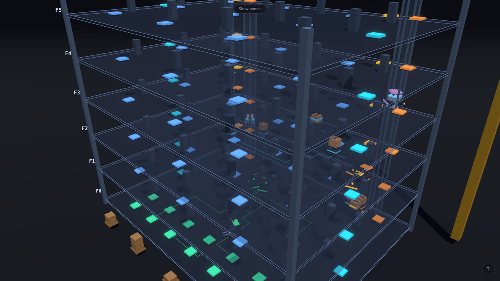
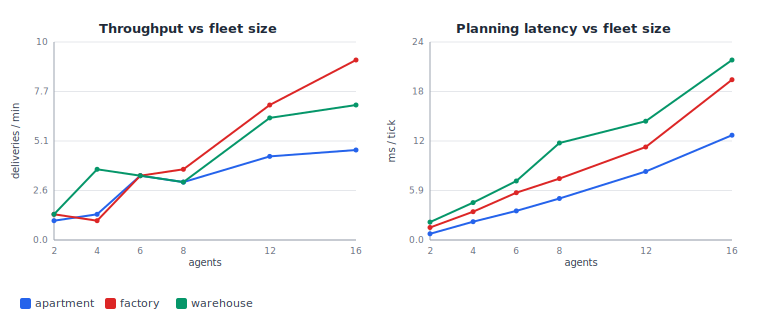

# MAPF Fleet — Multi-Robot Construction-Site Simulator

[](https://github.com/hurjun/mapf-fleet/actions/workflows/ci.yml)

An interactive, real-time **3D simulation of a multi-robot fleet** working a
multi-floor construction site. Dozens of robots move materials between floors
while planning **collision-free paths**, **yielding** to one another in tight
spots, and **queueing for capacity-limited elevators** — and a built-in model
recommends the **optimal fleet size** for any building you configure.

Built with Next.js, React Three Fiber, and a from-scratch TypeScript
multi-agent path-finding (MAPF) engine.




> *Above: the same simulator with the panels hidden (press <kbd>U</kbd>) and every
> robot's planned path overlaid (press <kbd>P</kbd>) — robots ferry material up a
> six-floor tower while installed structure accumulates per floor. This is a real
> frame captured from the running app in headless Chromium; regenerate it with
> [`scripts/screenshot.mjs`](scripts/screenshot.mjs).*

> **Run it locally in about a minute** — see [Running locally](#running-locally).
> It is a zero-config Next.js app, so it can also be one-click deployed to Vercel
> ([Deployment](#deployment-vercel)). ·
> **Tip:** drag to orbit the building, then use the sliders to reshape the site
> and the fleet in real time.

---

## Highlights

- **Real multi-agent path finding.** A prioritized planner runs a *windowed
  cooperative space-time A\** (WHCA\*) for every robot against a shared
  reservation table. Collisions and head-on swaps are provably avoided, and
  yielding/queuing behavior **emerges** from the planner rather than being
  scripted.
- **Three switchable sites.** A tall **apartment** high-rise (every job crosses
  floors, so the elevators dominate), a wide multi-floor **factory**, and a
  **warehouse** of storage aisles feeding shipping docks — same engine, different
  layouts.
- **Two planners, switchable live.** The fast prioritized planner, or
  **Conflict-Based Search (CBS)** — an optimal MAPF algorithm — toggled from the
  UI without restarting the run.
- **Capacity-limited elevators with queues.** Each car runs a LOOK-style
  scheduler; robots form a visible line at the boarding pad and the car fills to
  capacity before departing.
- **Battery & charging stations.** Robots drain a battery as they work, divert
  to a free charger when low, recharge, and resume — a real capacity-limited
  scheduling constraint, shown with per-robot battery bars.
- **Reads like a construction site.** Floors are clearly stacked, outlined decks
  tied together by a steel frame with floor labels; a tower crane (apartment) or
  gantry crane (factory/warehouse) looms over staged material pallets; elevator
  cars travel lit shafts; and **installed structure visibly accumulates** at each
  delivery point as the fleet builds the site out.
- **Live fleet-size optimizer with model-vs-reality overlay.** An analytical
  throughput model — derived from the *actual* generated layout — predicts
  deliveries/minute vs. fleet size, recommends a deployment, and names the
  binding bottleneck. The measured throughput from the running simulation is
  plotted right on top of the prediction.
- **Inspect and visualize.** Click any robot for a live inspector and its
  planned path; toggle all paths to watch the planner coordinate the fleet; read
  a 2D floor minimap, live trend charts, camera presets, and a single-floor focus
  mode — with optional bloom for a striking look.
- **Configure everything live.** Floors, elevator count and capacity, floor
  size, fleet size, planner, and speed are all adjustable while the simulation
  runs — robots are added or removed without restarting.
- **Readable at a glance.** Robots are detailed per-kind models color-coded by
  state (heading to a pickup, carrying, yielding, waiting for a lift, riding,
  charging), so what the fleet is doing is always obvious.

---

## How it works

The simulation engine (`src/sim/`) is pure, framework-free TypeScript with no
rendering or DOM dependencies, so it runs identically in unit tests and in the
browser. The 3D scene and UI (`src/three/`, `src/components/`) are a thin,
reactive layer on top of it.

### World model

The site is a stack of 2D grids — one per floor — connected by elevators. Each
cell is free space, a wall (structure/machinery/shaft), or an elevator
boarding/exit pad. Pickup and dropoff stations sit on walkable cells. The two
scenarios are produced procedurally by `scenarios.ts`.

### Path finding (the MAPF core)

> A standalone **[ALGORITHMS.md](ALGORITHMS.md)** walks through the `(x, y, t)`
> state space, the space-time reservation table, WHCA\*, and CBS in depth — with
> complexity notes, a reproducible worked example, and references.

Robots navigate with a **prioritized, cooperative** scheme:

1. **Single-agent search** — `spaceTimeAStar` plans in the `(x, y, t)`
   state space over a short time window, treating cells and transitions that
   higher-priority robots have already reserved as obstacles. If the goal is
   beyond the window it returns the path to the closest reachable cell so the
   robot always makes progress (classic WHCA\*).
2. **Reservation table** — `reservation.ts` records the cells (vertices) and
   moves (edges) each robot will occupy. Edge keys are order-independent, which
   is what blocks two robots from swapping places head-on.
3. **Prioritized planning** — `planner.ts` plans robots in priority order
   (loaded first, then whoever has waited longest, breaking stand-offs over
   time). A robot that cannot make progress simply holds position — that is the
   **yielding** you see. Because only the very next step is ever executed, the
   planner also reserves each not-yet-planned robot's current cell for the next
   tick, which **guarantees no two robots ever land on the same cell**.

Alternatively, the **CBS** planner (`cbs.ts`) can be selected at runtime. It is
a two-level search: a high-level best-first search over a binary *constraint
tree* finds the first vertex/edge conflict between two agents and branches,
forbidding one agent from it, while a constrained low-level space-time A\*
replans just that agent. It runs per floor over the window with a node budget,
falling back to the prioritized planner if a floor can't be resolved in budget,
so it stays real-time and never stalls.

### Elevators

`elevator.ts` models each car as a capacity-limited transport running a
**LOOK scan**: keep moving in the current direction while there is a stop to
serve ahead (a rider's destination, or a floor with a waiting robot), otherwise
reverse, otherwise idle. A full car ignores hall calls and heads straight for
its riders' destinations. The shaft sits *between* the boarding and exit pads so
the boarding queue can never block an exit — a subtle but important
deadlock-avoidance detail.

### Battery & charging

Each robot drains a battery as it works (faster while carrying). When it drops
below a threshold it claims the nearest free charger on its floor, drives there,
recharges, and resumes. Chargers hold one robot at a time, so charging is a
genuine scheduling constraint rather than a cosmetic detail. The optimizer folds
the resulting charging duty cycle into an **availability factor** so its
prediction stays aligned with the simulation.

### Fleet-size optimizer

`optimize.ts` answers "how many robots should I deploy?" It builds the world to
measure real free space and the true pickup/dropoff-to-elevator distances (via
reverse-BFS distance fields), then combines:

- a **floor-congestion** model (a traffic "fundamental diagram": robots slow as
  density rises), and
- an **elevator-capacity ceiling** (boardings served per round trip).

Sweeping the fleet size yields the throughput curve; its knee is the
**recommended** fleet (the smallest one within 95% of the peak), and the binding
term identifies the **bottleneck**. The full derivation is documented inline. As
the simulation runs, the measured throughput at each fleet size is recorded and
drawn as points over the predicted curve — model versus reality, side by side.

---

## What's implemented (and what isn't)

A deliberately honest scope, so the engineering claims are easy to verify.

**Genuinely implemented, from scratch:**

- A\* and a **windowed cooperative space-time A\*** (WHCA\*) over `(x, y, t)`.
- A **space-time reservation table** with order-independent edge keys, which is
  what provably blocks head-on swaps.
- A **prioritized planner** whose next-step reservation discipline guarantees no
  two robots ever land on the same cell.
- **Conflict-Based Search** (two-level constraint-tree search, vertex *and* edge
  conflicts, constrained low-level replanning).
- Capacity-limited **elevators** (LOOK scheduler), **battery/charging** as a real
  scheduling constraint, and procedural **apartment / factory / warehouse** worlds.
- An analytical **fleet-size optimizer** validated live against the simulation.
- A **deterministic, seeded** engine with unit tests asserting the collision-free
  invariant on every tick.

**Simplifications and non-goals (by design):**

- Robots are **single-cell and uniform-speed** — no heterogeneous footprints or
  speeds (listed as an extension).
- CBS runs on a **rolling window with a per-floor node budget** and **falls back
  to the prioritized planner** when a floor can't be resolved in budget. So its
  optimality is *per-window, within budget* — it is a real-time planner, not a
  full offline optimal solver over the whole episode.
- The prioritized planner alone is **incomplete** (it can deadlock on tightly
  coupled instances); the engine recovers with a heuristic priority-shuffle, and
  CBS removes the failure mode. See the worked example in
  [ALGORITHMS.md](ALGORITHMS.md).
- Task assignment is **greedy under uniform demand** — no deadlines or priorities.
- The optimizer's traffic constants (jam density, min speed) are **hand-tuned,
  not calibrated** from data (auto-calibration is an extension).
- No **hosted demo** yet; run locally, or one-click deploy to Vercel.

---

## Performance & scaling

A headless benchmark ([`scripts/benchmark.ts`](scripts/benchmark.ts), driven by
the pure library in [`src/sim/scaling.ts`](src/sim/scaling.ts)) drives the **real
engine** — no rendering — across fleet sizes, scenarios, and seeds. For each run
it times only the per-tick `Engine.step()` call (which is dominated by the
multi-agent planner), records the delivery throughput and coordination quality
the planner achieves, and **re-checks the collision-free invariant on every
tick**. Reproduce it with `npm run bench`; it regenerates the figure below and
[`docs/benchmark.json`](docs/benchmark.json).



Each row below averages **3 seeds × 300 timed ticks** (40-tick warm-up) under the
prioritized WHCA\* planner. *Planning* is the mean wall-clock time per tick;
*Success* is the fraction of seeds that stayed collision-free and live.

**apartment** — 6 floors, 24×18, 2 elevators (cap 2):

| Agents | Throughput (del/min) | Planning (ms/tick) | Avg wait (ticks) | Congestion | Collisions | Success |
| -----: | -------------------: | -----------------: | ---------------: | ---------: | ---------: | ------: |
| 2 | 1.0 | 0.75 | 17.6 | 0% | 0 | 100% |
| 4 | 1.3 | 2.19 | 23.2 | 0% | 0 | 100% |
| 6 | 3.3 | 3.47 | 25.5 | 28% | 0 | 100% |
| 8 | 3.0 | 4.96 | 36.5 | 25% | 0 | 100% |
| 12 | 4.3 | 8.18 | 66.5 | 44% | 0 | 100% |
| 16 | 4.7 | 12.52 | 101.5 | 46% | 0 | 100% |

**factory** — 3 floors, 30×22, 3 elevators (cap 3):

| Agents | Throughput (del/min) | Planning (ms/tick) | Avg wait (ticks) | Congestion | Collisions | Success |
| -----: | -------------------: | -----------------: | ---------------: | ---------: | ---------: | ------: |
| 2 | 1.3 | 1.49 | 5.5 | 17% | 0 | 100% |
| 4 | 1.0 | 3.38 | 9.0 | 0% | 0 | 100% |
| 6 | 3.3 | 5.65 | 8.9 | 11% | 0 | 100% |
| 8 | 3.7 | 7.33 | 10.0 | 4% | 0 | 100% |
| 12 | 7.0 | 11.11 | 10.8 | 22% | 0 | 100% |
| 16 | 9.3 | 19.15 | 12.5 | 2% | 0 | 100% |

**warehouse** — 2 floors, 36×26, 2 elevators (cap 3):

| Agents | Throughput (del/min) | Planning (ms/tick) | Avg wait (ticks) | Congestion | Collisions | Success |
| -----: | -------------------: | -----------------: | ---------------: | ---------: | ---------: | ------: |
| 2 | 1.3 | 2.14 | 4.3 | 0% | 0 | 100% |
| 4 | 3.7 | 4.47 | 3.1 | 0% | 0 | 100% |
| 6 | 3.3 | 7.05 | 3.0 | 6% | 0 | 100% |
| 8 | 3.0 | 11.59 | 46.7 | 50% | 0 | 100% |
| 12 | 6.3 | 14.19 | 13.3 | 0% | 0 | 100% |
| 16 | 7.0 | 21.50 | 24.0 | 25% | 0 | 100% |

**Prioritized WHCA\* vs optimal CBS** (factory, 2 seeds × 200 ticks):

| Agents | Planner | Throughput (del/min) | Planning (ms/tick) | Avg wait (ticks) | Congestion |
| -----: | ------- | -------------------: | -----------------: | ---------------: | ---------: |
| 4 | prioritized | 1.5 | 4.11 | 10.5 | 0% |
| 4 | cbs | 1.5 | 5.39 | 10.5 | 0% |
| 8 | prioritized | 5.0 | 10.02 | 10.5 | 25% |
| 8 | cbs | 5.0 | 34.85 | 10.4 | 25% |
| 12 | prioritized | 6.5 | 13.50 | 13.9 | 13% |
| 12 | cbs | 6.5 | 123.82 | 14.1 | 13% |

**What the numbers show**

- **Collision-free at scale.** Across all 66 runs — over **21,000 simulated
  ticks** — the per-tick check found **zero** collisions and every run stayed
  live, promoting the unit-test invariant to a seed-swept, multi-scenario result.
- **Throughput saturates, and the shape names the bottleneck.** The tall
  apartment (6 floors / 2 small elevators) plateaus near ~4.7 del/min while its
  average wait climbs from 18 to 102 ticks — robots queue for the lift, exactly
  the elevator-capacity regime the [fleet-size optimizer](#fleet-size-optimizer)
  predicts. The flatter factory and warehouse keep scaling (factory reaches 9.3
  del/min at 16 agents).
- **Planning stays real-time.** Prioritized WHCA\* costs sub-millisecond to
  ~20 ms/tick up to 16 agents, growing roughly linearly-to-super-linearly with
  fleet size (each added agent both plans and is planned around).
- **The classic MAPF trade-off, measured.** On these loosely-coupled floors the
  prioritized planner is already near-optimal, so optimal **CBS matches its
  throughput and wait but costs up to ~9× the compute** (factory, 12 agents:
  13.5 vs 123.8 ms/tick — and a single hard seed pushed CBS past 200 ms/tick).
  CBS earns its keep only on tightly-coupled instances; that is why it ships as
  an *option* with a node-budget fallback, not the default.

> Numbers are from `node v20.11.0` on an Apple M2, executing the TypeScript
> engine directly via `vite-node` (a production bundle runs faster); the
> machine-independent story is the *shape* of each curve and the
> prioritized-vs-CBS ratio. Full per-seed data is in `docs/benchmark.json`.

---

## Exploring the simulation

- **Click a robot** to select it: a halo marks it, its planned path is drawn, and
  an inspector shows its live status, battery, task, and plan.
- **Show all planned paths** to see the whole fleet's coordinated plans at once.
- **Floor minimap** gives a 2D top-down plan; clicking a dot selects that robot.
- **Trends** charts plot throughput, congestion, and elevator load over time.
- **Camera presets** (iso / top / side) and **single-floor focus** isolate a
  level for close inspection.
- **Congestion heatmap** highlights where the fleet stalls (elevator queues,
  pinch points).
- **Planner toggle** switches prioritized ↔ CBS live; **Glow** toggles bloom.
- **Step mode + keyboard shortcuts** (Space, S, P, F, 1/2/3, arrows, [ / ], Esc).
- **Shareable URL**: the configuration lives in the query string; **Download CSV**
  exports the run's metric history.

---

## Tech stack

| Layer        | Technology                                            |
| ------------ | ----------------------------------------------------- |
| Framework    | Next.js 14 (App Router), React 18, TypeScript (strict) |
| 3D rendering | three.js via React Three Fiber + drei                 |
| State        | Zustand                                               |
| Styling      | Tailwind CSS                                          |
| Testing      | Vitest                                                |
| Hosting      | Vercel                                                |

## Project structure

```
src/
├── sim/                 # framework-free simulation engine (unit-tested)
│   ├── types.ts         # core domain types
│   ├── grid.ts          # walkability, neighbours, BFS distance fields
│   ├── astar.ts         # A* and windowed space-time A* (WHCA*)
│   ├── reservation.ts   # space-time reservation table
│   ├── planner.ts       # prioritized multi-agent planner
│   ├── cbs.ts           # Conflict-Based Search (optimal) planner
│   ├── elevator.ts      # elevator car + LOOK scheduler
│   ├── engine.ts        # tasks, robot state machine, battery, tick loop
│   ├── scenarios.ts     # apartment / factory world generators
│   └── optimize.ts      # analytical fleet-size optimizer
├── state/               # Zustand store + real-time tick loop
├── three/               # R3F scene: building, fleet, elevators, paths, bloom
├── components/          # control / metrics / optimizer / inspector / minimap UI
└── app/                 # Next.js app-router entry
```

## Running locally

```bash
npm install
npm run dev
# open http://localhost:3000
```

Other scripts:

```bash
npm run build       # production build
npm test            # run the engine unit tests (watch)
npm run test:run    # run the unit tests once
npm run lint        # lint
```

## Testing

The engine is covered by Vitest unit tests, including an integration test that
asserts the **collision-free invariant holds on every tick** and that
cross-floor deliveries complete end-to-end on both scenarios:

```bash
npm run test:run
```

## Deployment (Vercel)

The project is a standard Next.js app and deploys to Vercel with zero
configuration:

1. Push this repository to GitHub.
2. Import it at [vercel.com/new](https://vercel.com/new) — Vercel auto-detects
   Next.js.
3. Deploy. (No environment variables are required.)

## Possible extensions

- Heterogeneous robot speeds and footprints (multi-cell robots).
- Auto-calibrating the optimizer's constants from the measured points.
- Priority/deadline-aware task assignment instead of unlimited uniform demand.
- Bounded-suboptimal CBS variants (ECBS) for larger fleets.

## References

The planners follow the primary MAPF literature; the full list with complexity
notes is in [ALGORITHMS.md](ALGORITHMS.md). The key sources:

- D. Silver. *Cooperative Pathfinding.* AIIDE, 2005. — Windowed Hierarchical
  Cooperative A\* (WHCA\*), the basis of the prioritized planner.
- G. Sharon, R. Stern, A. Felner, N. R. Sturtevant. *Conflict-Based Search for
  Optimal Multi-Agent Pathfinding.* Artificial Intelligence 219 (2015), 40–66. —
  the CBS planner.
- R. Stern et al. *Multi-Agent Pathfinding: Definitions, Variants, and
  Benchmarks.* SoCS, 2019. — vertex/edge/swap conflict terminology.

## Author

Built by **hurjun** as a portfolio project exploring multi-agent path finding,
fleet coordination, and capacity planning for robot fleets in construction and
logistics settings.

## License

Released under the [MIT License](LICENSE).
