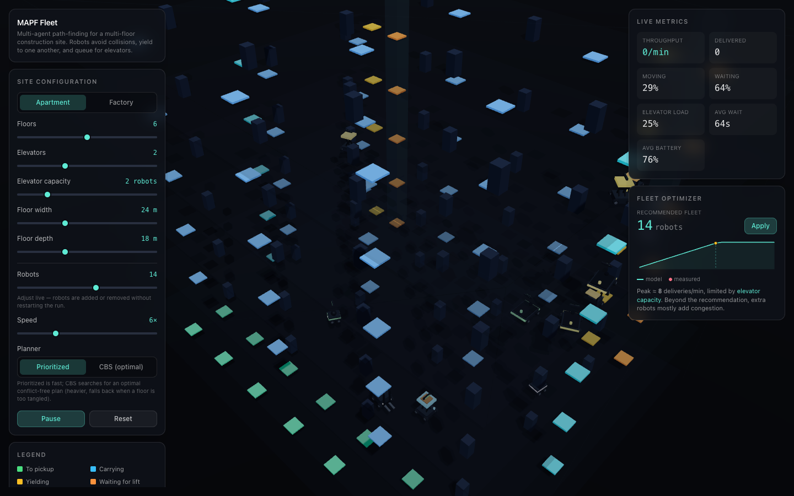

# MAPF Fleet — Multi-Robot Construction-Site Simulator

An interactive, real-time **3D simulation of a multi-robot fleet** working a
multi-floor construction site. Dozens of robots move materials between floors
while planning **collision-free paths**, **yielding** to one another in tight
spots, and **queueing for capacity-limited elevators** — and a built-in model
recommends the **optimal fleet size** for any building you configure.

Built with Next.js, React Three Fiber, and a from-scratch TypeScript
multi-agent path-finding (MAPF) engine.



> **Live demo:** _deploy to Vercel and add the URL here_ ·
> **Tip:** drag to orbit the building, then use the sliders to reshape the site
> and the fleet in real time.

---

## Highlights

- **Real multi-agent path finding.** A prioritized planner runs a *windowed
  cooperative space-time A\** (WHCA\*) for every robot against a shared
  reservation table. Collisions and head-on swaps are provably avoided, and
  yielding/queuing behavior **emerges** from the planner rather than being
  scripted.
- **Two switchable construction sites.** A tall **apartment** high-rise (every
  job crosses floors, so the elevators dominate) and a wide **factory** (busy
  on-floor traffic plus elevator use) — same engine, different layouts.
- **Two planners, switchable live.** The fast prioritized planner, or
  **Conflict-Based Search (CBS)** — an optimal MAPF algorithm — toggled from the
  UI without restarting the run.
- **Capacity-limited elevators with queues.** Each car runs a LOOK-style
  scheduler; robots form a visible line at the boarding pad and the car fills to
  capacity before departing.
- **Battery & charging stations.** Robots drain a battery as they work, divert
  to a free charger when low, recharge, and resume — a real capacity-limited
  scheduling constraint, shown with per-robot battery bars.
- **Live fleet-size optimizer with model-vs-reality overlay.** An analytical
  throughput model — derived from the *actual* generated layout — predicts
  deliveries/minute vs. fleet size, recommends a deployment, and names the
  binding bottleneck. The measured throughput from the running simulation is
  plotted right on top of the prediction.
- **Configure everything live.** Floors, elevator count and capacity, floor
  size, fleet size, planner, and speed are all adjustable while the simulation
  runs — robots are added or removed without restarting.
- **Readable at a glance.** Robots are detailed per-kind models color-coded by
  state (heading to a pickup, carrying, yielding, waiting for a lift, riding,
  charging), so what the fleet is doing is always obvious.

---

## How it works

The simulation engine (`src/sim/`) is pure, framework-free TypeScript with no
rendering or DOM dependencies, so it runs identically in unit tests and in the
browser. The 3D scene and UI (`src/three/`, `src/components/`) are a thin,
reactive layer on top of it.

### World model

The site is a stack of 2D grids — one per floor — connected by elevators. Each
cell is free space, a wall (structure/machinery/shaft), or an elevator
boarding/exit pad. Pickup and dropoff stations sit on walkable cells. The two
scenarios are produced procedurally by `scenarios.ts`.

### Path finding (the MAPF core)

Robots navigate with a **prioritized, cooperative** scheme:

1. **Single-agent search** — `spaceTimeAStar` plans in the `(x, y, t)`
   state space over a short time window, treating cells and transitions that
   higher-priority robots have already reserved as obstacles. If the goal is
   beyond the window it returns the path to the closest reachable cell so the
   robot always makes progress (classic WHCA\*).
2. **Reservation table** — `reservation.ts` records the cells (vertices) and
   moves (edges) each robot will occupy. Edge keys are order-independent, which
   is what blocks two robots from swapping places head-on.
3. **Prioritized planning** — `planner.ts` plans robots in priority order
   (loaded first, then whoever has waited longest, breaking stand-offs over
   time). A robot that cannot make progress simply holds position — that is the
   **yielding** you see. Because only the very next step is ever executed, the
   planner also reserves each not-yet-planned robot's current cell for the next
   tick, which **guarantees no two robots ever land on the same cell**.

Alternatively, the **CBS** planner (`cbs.ts`) can be selected at runtime. It is
a two-level search: a high-level best-first search over a binary *constraint
tree* finds the first vertex/edge conflict between two agents and branches,
forbidding one agent from it, while a constrained low-level space-time A\*
replans just that agent. It runs per floor over the window with a node budget,
falling back to the prioritized planner if a floor can't be resolved in budget,
so it stays real-time and never stalls.

### Elevators

`elevator.ts` models each car as a capacity-limited transport running a
**LOOK scan**: keep moving in the current direction while there is a stop to
serve ahead (a rider's destination, or a floor with a waiting robot), otherwise
reverse, otherwise idle. A full car ignores hall calls and heads straight for
its riders' destinations. The shaft sits *between* the boarding and exit pads so
the boarding queue can never block an exit — a subtle but important
deadlock-avoidance detail.

### Battery & charging

Each robot drains a battery as it works (faster while carrying). When it drops
below a threshold it claims the nearest free charger on its floor, drives there,
recharges, and resumes. Chargers hold one robot at a time, so charging is a
genuine scheduling constraint rather than a cosmetic detail. The optimizer folds
the resulting charging duty cycle into an **availability factor** so its
prediction stays aligned with the simulation.

### Fleet-size optimizer

`optimize.ts` answers "how many robots should I deploy?" It builds the world to
measure real free space and the true pickup/dropoff-to-elevator distances (via
reverse-BFS distance fields), then combines:

- a **floor-congestion** model (a traffic "fundamental diagram": robots slow as
  density rises), and
- an **elevator-capacity ceiling** (boardings served per round trip).

Sweeping the fleet size yields the throughput curve; its knee is the
**recommended** fleet (the smallest one within 95% of the peak), and the binding
term identifies the **bottleneck**. The full derivation is documented inline. As
the simulation runs, the measured throughput at each fleet size is recorded and
drawn as points over the predicted curve — model versus reality, side by side.

---

## Tech stack

| Layer        | Technology                                            |
| ------------ | ----------------------------------------------------- |
| Framework    | Next.js 14 (App Router), React 18, TypeScript (strict) |
| 3D rendering | three.js via React Three Fiber + drei                 |
| State        | Zustand                                               |
| Styling      | Tailwind CSS                                          |
| Testing      | Vitest                                                |
| Hosting      | Vercel                                                |

## Project structure

```
src/
├── sim/                 # framework-free simulation engine (unit-tested)
│   ├── types.ts         # core domain types
│   ├── grid.ts          # walkability, neighbours, BFS distance fields
│   ├── astar.ts         # A* and windowed space-time A* (WHCA*)
│   ├── reservation.ts   # space-time reservation table
│   ├── planner.ts       # prioritized multi-agent planner
│   ├── cbs.ts           # Conflict-Based Search (optimal) planner
│   ├── elevator.ts      # elevator car + LOOK scheduler
│   ├── engine.ts        # tasks, robot state machine, battery, tick loop
│   ├── scenarios.ts     # apartment / factory world generators
│   └── optimize.ts      # analytical fleet-size optimizer
├── state/               # Zustand store + real-time tick loop
├── three/               # React Three Fiber scene (building, fleet, elevators)
├── components/          # control / metrics / optimizer UI panels
└── app/                 # Next.js app-router entry
```

## Running locally

```bash
npm install
npm run dev
# open http://localhost:3000
```

Other scripts:

```bash
npm run build       # production build
npm test            # run the engine unit tests (watch)
npm run test:run    # run the unit tests once
npm run lint        # lint
```

## Testing

The engine is covered by Vitest unit tests, including an integration test that
asserts the **collision-free invariant holds on every tick** and that
cross-floor deliveries complete end-to-end on both scenarios:

```bash
npm run test:run
```

## Deployment (Vercel)

The project is a standard Next.js app and deploys to Vercel with zero
configuration:

1. Push this repository to GitHub.
2. Import it at [vercel.com/new](https://vercel.com/new) — Vercel auto-detects
   Next.js.
3. Deploy. (No environment variables are required.)

## Possible extensions

- Heterogeneous robot speeds and footprints (multi-cell robots).
- Auto-calibrating the optimizer's constants from the measured points.
- Priority/deadline-aware task assignment instead of unlimited uniform demand.
- Bounded-suboptimal CBS variants (ECBS) for larger fleets.

## Author

Built by **hurjun** as a portfolio project exploring multi-agent path finding,
fleet coordination, and capacity planning for robot fleets in construction and
logistics settings.
